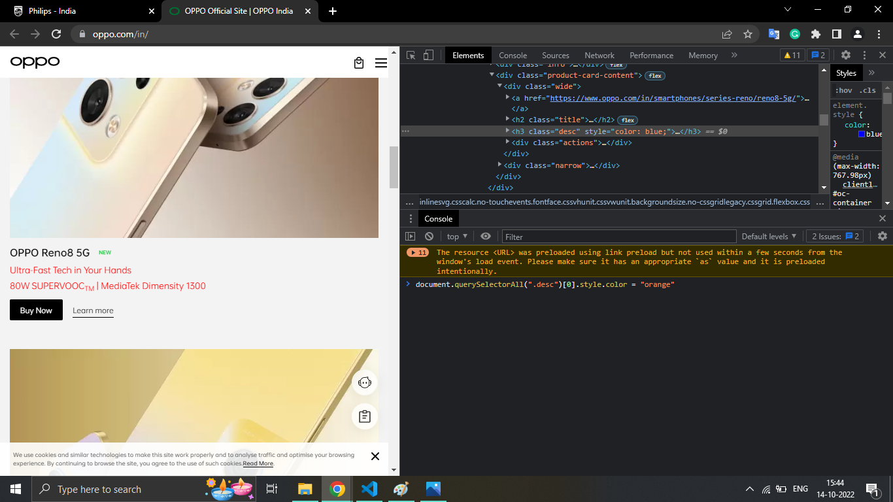

# 1. Webiste Name: [Dev To](https://dev.to/)
### Tasks
 Target the Top description div and change the DEV Community to <Your_Name> and description to your passion
### Sample Image


### Output


### Code:
``` javascript
document.querySelector(".side-bar .crayons-card .crayons-subtitle-2").innerText = "Meera Murthy"
document.querySelector(".side-bar .crayons-card .color-base-70").innerText = "Web developer / AI / Conversation designer"
```


# 2. Website Name: [Apple](https://support.apple.com/en-in)

### Topics
 - Get Element By Id, Create Element, Create Text Node, Append Child


### Tasks
  Add another FAQ 'My New FAQ' to the list

### Output

### Code:
```javascript
productlist = document.querySelectorAll(".as-imagegrid-item-title");
productlistarr = Array.from(productlist)
productlisttext = productlistarr.map(x=>x.innerText)
productlisttext1 = productlisttext.map(x=>x.split('\n')[0])
```


# 3. Webiste Name: [Youtube Support](https://support.google.com/youtube/)

### Topics

    - Get Element By Id, Create Element, Create Text Node, Append Child
### Sample Image


### Output


### Tasks

     Add another FAQ 'My New FAQ' to the list

### Code

```javascript
navnodelist = document.querySelectorAll("nav section.parent")
newele = navnodelist[7].cloneNode(true)
newele.querySelector("h3").setAttribute("aria-label", "My New FAQ")
newele.querySelector("h3").innerText = "My New FAQ"
document.querySelector("nav").appendChild(newele)
```


# 4. Webiste Name: [OnePlus](https://www.oneplus.in/support)

### Topics

     Query Selector, InnerText
### Sample Image


### Output


### Tasks

      Change the contact number

### Code

```javascript
document.querySelector(".one-tel-number").innerText = "+91 9999999999"
```


# 5. Webiste Name: [Samsung](https://www.samsung.com/in/offer/online/samsung-fest/)

### Topics

       getElementById, createElement, InnerText, append, setAttribute
### Sample Image


### Tasks

     Target the main div of card and change the Button text to Check out

### Output


### Code

```javascript
document.querySelectorAll(".diwali-deals-product-sale-btn")
btnlist = document.querySelectorAll(".diwali-deals-product-sale-btn")
Array.from(btnlist).map(x => x.innerText = "Check out")
```


# 6. Webiste Name: [Adidas](https://www.adidas.co.in/)

### Topics

    -   Query Selector, Event listeners, Changing Styles
### Sample Image


### Tasks

     Target the search box and on hover change thebackground color to red.

### Output


### Code
```javascript
function mouseover() { document.querySelectorAll("input")[0].style.backgroundColor = "red"; }
document.querySelectorAll("input")[0].setAttribute("onmouseover", "mouseover()")
function mouseOut() { document.querySelectorAll("input")[0].style.backgroundColor = "transparent" }
document.querySelectorAll("input")[0].setAttribute("onmouseout", "mouseOut()")
```


# 7. Webiste Name: [MDN Web Docs](https://developer.mozilla.org/en-US/)

### Topics

       Form, Value, Submit
### Sample Image


### Tasks

     To Search a topic in the MDN Search bar.
     First add a text to search in the search bar and then hit the submit search button to search the docs using DOM
### Output


### Code
```javascript
```


# 8. Webiste Name: [Google](https://www.google.com/)

### Topics

       Remove Elements

### Sample Image


### Tasks

     Remove alternate languages from the home page languages listed

### Output


### Code
```javascript
document.querySelectorAll("#SIvCob a")
document.querySelectorAll("#SIvCob a")[0].remove()
```


# 9. Webiste Name: [Code Wars](https://www.codewars.com/)

### Topics

       Change Font Family, Color of Text.

### Sample Image


### Tasks

    Change the font family of the text to monospace and text color to the logo’s background color.

### Output


### Code
```javascript
document.querySelectorAll(".display-heading-1")[0].style.color = "#b1361e"
document.querySelectorAll(".display-heading-1")[0].style.fontFamily = "monospace"
```


# 10. Webiste Name: [Freecodecamp](https://www.freecodecamp.org/)

### Topics

       querySelector, mouseover, click eventListener,  callback function, style,

### Sample Image


### Tasks

    Target the button and change background colour on mouseover

### Output


### Code
```javascript
function mouseover() { document.querySelector(".btn-block .login-btn-text").style.backgroundColor = "red"; }
function mouseOut() { document.querySelector(".btn-block .login-btn-text").style.backgroundColor = "transparent" }
document.querySelector(".btn-block .login-btn-text").setAttribute("onmouseover", "mouseover()")
document.querySelector(".btn-block .login-btn-text").setAttribute("onmouseout", "mouseOut()")
```


# 11. Webiste Name: [realme](https://www.realme.com/in/)

### Topics

       querySelector,style,background-image

### Sample Image


### Tasks

    change the realme logo to ineuron logo

### Output


### Code
```javascript
document.querySelector(".logo").innerHTML = ""
```


# 12. Webiste Name: [Github](https://github.com/)

### Topics

       querySelector,style,background-Color

### Sample Image


### Tasks

     change the background colour of the button to blue.

### Output


### Code
```javascript
document.querySelector(".js-repo-form .btn").style.backgroundColor = "blue"
```


# 13. Webiste Name: [Hackerrank](https://www.hackerrank.com/)

### Topics

       querySelector,innerHtml

### Sample Image


### Tasks

Target the top description and change “Matching developers with great companies” to ‘JSBOOTCAMP“.

### Output


### Code
```javascript
document.querySelectorAll(".fl-heading-text")[0].innerText = "JSBOOTCAMP"
```


# 14. Webiste Name: [Asus](https://www.asus.com/in/)

### Topics

      querySelector,style,font-size

### Sample Image


### Tasks

       change the fontsize of “Hot Deals” to 80px

### Output


### Code
```javascript
document.querySelector(".HotDealsAll__Heading__2fIbe").style.fontSize = "80px"
```


# 15. Webiste Name: [Dell](https://www.dell.com/en-in/shop/deals/laptop-deals?gacd=10415953-9016-5761040-285981356-0&dgc=ST&gclid=Cj0KCQjwguGYBhDRARIsAHgRm4-XUDMhhVNyHXb3s1gY4ZBzORr_d9Se-buhJwy7asyUe7YdqEA11eEaAt6UEALw_wcB&gclsrc=aw.ds&nclid=BxjBlpBQsX6pjSHh-L8YYSU77EpfXRkG1AGMB5Wbeu386ykspfrPDnfx_DdFau20)

### Topics

      querySelector,style.textAlign

### Sample Image


### Tasks

       Convert the text “G15 Gaming Laptop” from left to right

### Output


### Code
```javascript
document.querySelectorAll(".ps-title")[4].style.textAlign = "right"
```


# 16. Webiste Name: [Vercel](https://vercel.com/)

### Topics

     querySelector,innerHTMl

### Sample Image


### Tasks

      change the heading “Start with the developer” to “Start with Scratch”

### Output


### Code
```javascript
document.querySelectorAll(".section-title_title__VEDfK")[0].innerText = "Start with Scratch"
```


# 17. Webiste Name: [Sony](https://www.sony.co.in/)

### Topics

    querySelector,innerHTMl

### Sample Image


### Tasks

     change the button text To current Date.

### Output


### Code
```javascript
document.querySelector(".retailer_btn-align").innerHTML = new Date()
```


# 18. Webiste Name: [Philips](https://www.philips.co.in/)

### Topics

     querySelector,style,backgroundcolor

### Sample Image


### Tasks

    change the background colour blue to orange

### Output


### Code
```javascript
document.querySelector(".p-footer").style.backgroundColor = "orange"
```


# 19. Webiste Name: [Canon](https://in.canon/)

### Topics

          querySelector,src

### Sample Image


### Tasks

    extract the canon logo

### Output


### Code
```javascript
document.querySelector(".logo").getAttribute("src")
```


# 20. Webiste Name: [Oppo](https://www.oppo.com/in/)

### Topics

          querySelector,style,color

### Sample Image


### Tasks

      Change the description colour black to orange

### Output


### Code
```javascript
document.querySelectorAll(".desc")[0].style.color = "orange"
```



